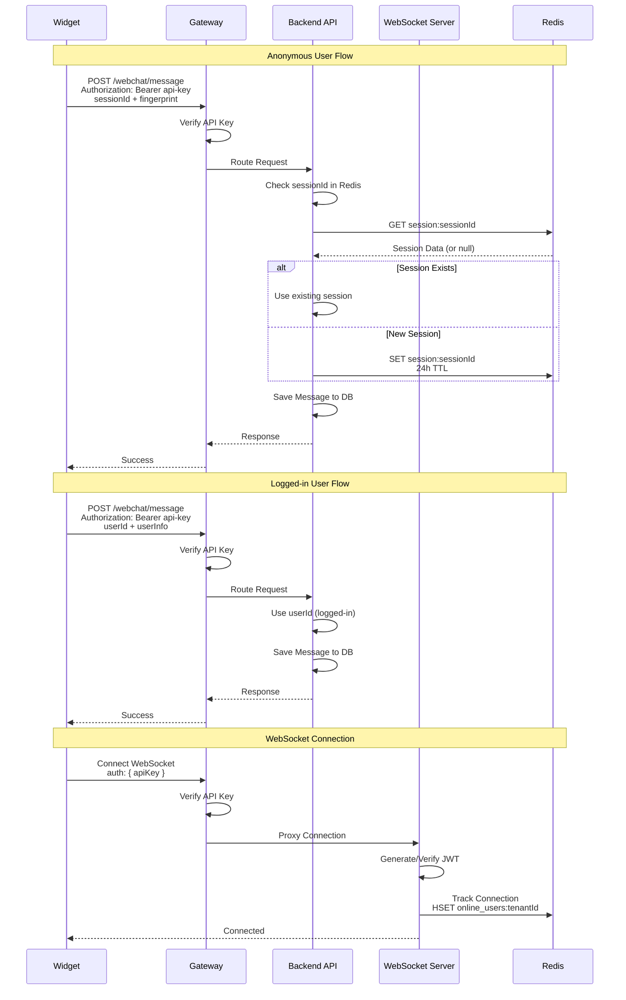
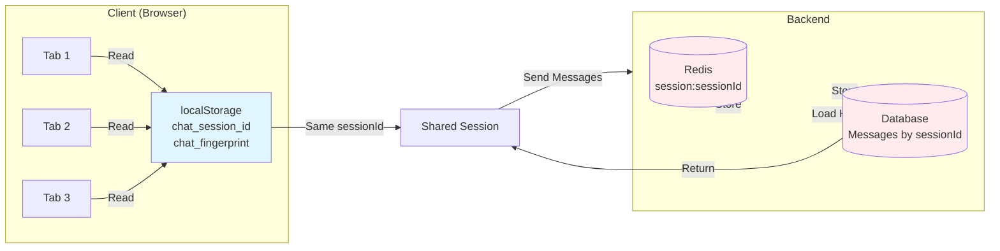
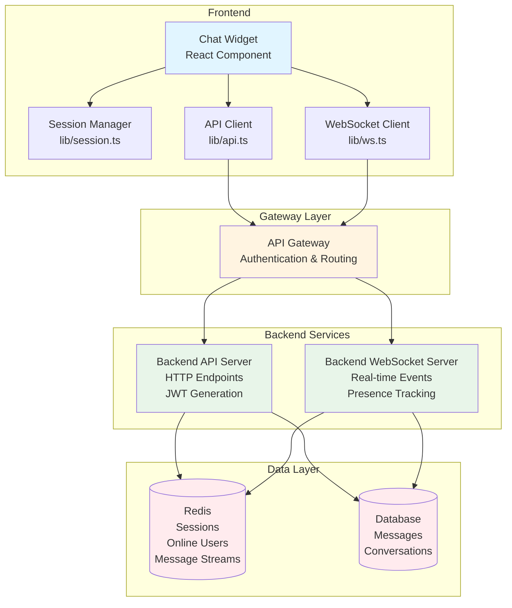

# System Flow Diagram

## Complete System Flow

```mermaid
graph TB
    subgraph "Client Side"
        Widget[Chat Widget<br/>Frontend]
        Session[Session Manager<br/>localStorage]
        API[ChatAPI<br/>HTTP Client]
        WS[ChatWebSocket<br/>Socket.io Client]
    end

    subgraph "Gateway"
        Gateway[API Gateway<br/>Authentication Layer]
        Auth[API Key<br/>Verification]
        Router[Request Router]
        WSProxy[WebSocket Proxy]
    end

    subgraph "Backend Services"
        APIServer[Backend API Server<br/>JWT Generation]
        WSServer[Backend WebSocket Server<br/>Real-time]
        Redis[(Redis<br/>Sessions & Presence)]
        DB[(Database<br/>Messages)]
    end

    %% Widget Initialization
    Widget -->|1. Load| Session
    Session -->|2. Get/Create| SessionID[sessionId + fingerprint]
    Widget -->|3. Initialize| API
    Widget -->|4. Initialize| WS

    %% HTTP Message Flow
    Widget -->|5. Send Message| API
    API -->|6. Add sessionId + fingerprint| Payload[Message Payload]
    API -->|7. POST /webchat/message<br/>Authorization: Bearer api-key| Gateway
    Gateway -->|8. Verify API Key| Auth
    Auth -->|9. Valid| Router
    Router -->|10. Route Request| APIServer
    APIServer -->|11. Process Message<br/>Determine User Type| UserType{User Type?}
    UserType -->|userId present| LoggedIn[Logged-in User]
    UserType -->|no userId| Anonymous[Anonymous User<br/>Use sessionId]
    APIServer -->|12. Store Session| Redis
    APIServer -->|13. Save Message| DB
    APIServer -->|14. Return Response| Router
    Router -->|15. Response| Gateway
    Gateway -->|16. Response| API
    API -->|17. Update UI| Widget

    %% WebSocket Connection Flow
    Widget -->|18. Connect| WS
    WS -->|19. Connect with API Key<br/>auth: apiKey| Gateway
    Gateway -->|20. Verify API Key| Auth
    Auth -->|21. Valid| WSProxy
    WSProxy -->|22. Proxy Connection| WSServer
    WSServer -->|23. Verify JWT<br/>Track Connection| Redis
    WSServer -->|24. Join Rooms| Rooms[tenant:tenantId<br/>conversation:sessionId<br/>admin:tenantId]

    %% WebSocket Message Flow
    Widget -->|25. Send via WS| WS
    WS -->|26. Emit 'message'<br/>with sessionId + fingerprint| Gateway
    Gateway -->|27. Proxy Event| WSServer
    WSServer -->|28. Process Message| ProcessMsg[Generate messageId<br/>Get sessionId/userId]
    WSServer -->|29. Push to Stream| Redis
    WSServer -->|30. Broadcast| Broadcast[io.to conversation:sessionId<br/>emit 'meta_message_created']
    Broadcast -->|31. Event| WS
    WS -->|32. Update UI| Widget

    %% Online Users Flow
    Widget -->|33. Admin Request| WS
    WS -->|34. Emit 'get_online_users'| Gateway
    Gateway -->|35. Proxy| WSServer
    WSServer -->|36. Query Redis| Redis
    Redis -->|37. HGETALL online_users:tenantId| WSServer
    WSServer -->|38. Emit 'online_users_list'| Gateway
    Gateway -->|39. Event| WS
    WS -->|40. Update Admin UI| Widget

    %% Presence Tracking
    WSServer -->|41. User Online| Redis
    Redis -->|42. HSET online_users:tenantId| Presence[Store User Data]
    WSServer -->|43. Emit 'user_online'| AdminRoom[admin:tenantId room]
    AdminRoom -->|44. Broadcast| WS
    WS -->|45. Real-time Update| Widget

    %% Conversation History
    Widget -->|46. Load History| API
    API -->|47. GET /api/chat/messages<br/>?tenantId&sessionId&userId| Gateway
    Gateway -->|48. Route| APIServer
    APIServer -->|49. Query by sessionId/userId| DB
    DB -->|50. Return Messages| APIServer
    APIServer -->|51. Response| Gateway
    Gateway -->|52. Response| API
    API -->|53. Display History| Widget

    style Widget fill:#e1f5ff
    style Gateway fill:#fff4e1
    style APIServer fill:#e8f5e9
    style WSServer fill:#e8f5e9
    style Redis fill:#ffebee
    style DB fill:#ffebee
```

## Authentication Flow



## Session Management Flow



## Message Flow Comparison

```mermaid
graph TB
    subgraph "HTTP API Flow"
        W1[Widget] -->|1. sendMessage| API1[ChatAPI]
        API1 -->|2. POST /webchat/message<br/>+ sessionId + fingerprint| G1[Gateway]
        G1 -->|3. Route| B1[Backend API]
        B1 -->|4. Save| DB1[(Database)]
        B1 -->|5. Response| G1
        G1 -->|6. Response| API1
        API1 -->|7. Update UI| W1
    end

    subgraph "WebSocket Flow"
        W2[Widget] -->|1. sendMessage| WS1[ChatWebSocket]
        WS1 -->|2. Emit 'message'<br/>+ sessionId + fingerprint| G2[Gateway]
        G2 -->|3. Proxy| WS2[WebSocket Server]
        WS2 -->|4. Push to Stream| R1[(Redis Stream)]
        WS2 -->|5. Broadcast| Room[conversation:sessionId]
        Room -->|6. Emit 'meta_message_created'| WS1
        WS1 -->|7. Real-time Update| W2
    end

    style W1 fill:#e1f5ff
    style W2 fill:#e1f5ff
    style G1 fill:#fff4e1
    style G2 fill:#fff4e1
    style B1 fill:#e8f5e9
    style WS2 fill:#e8f5e9
```



## Architecture Overview



